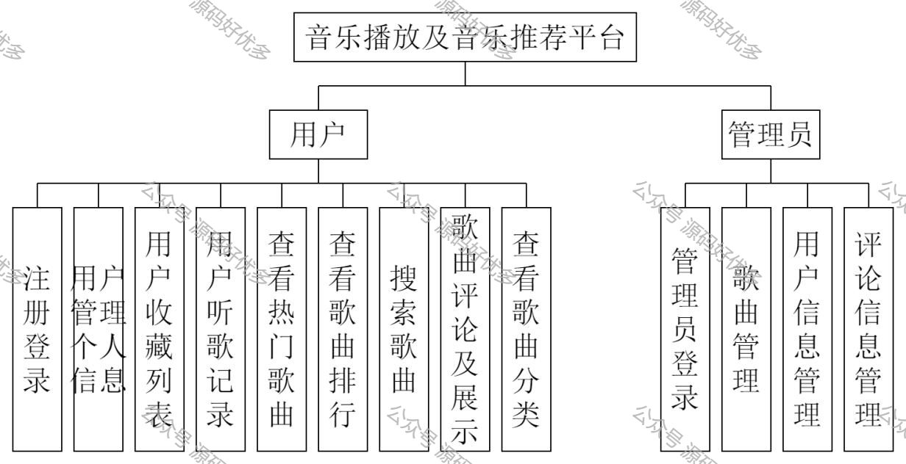
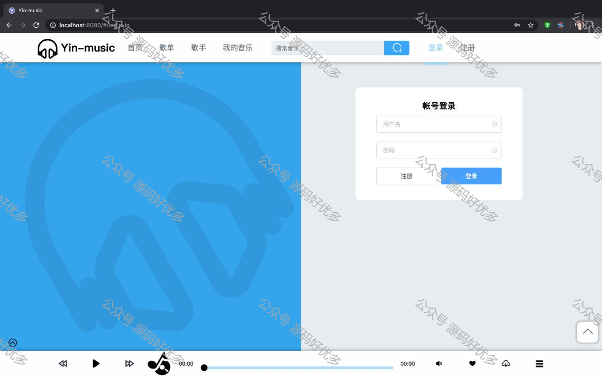
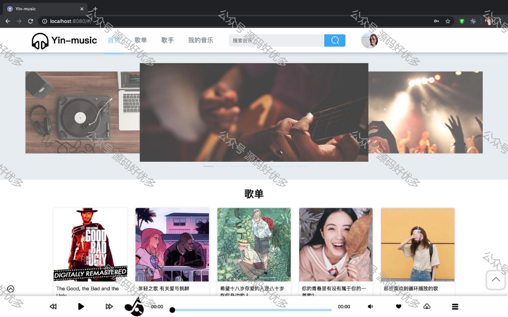
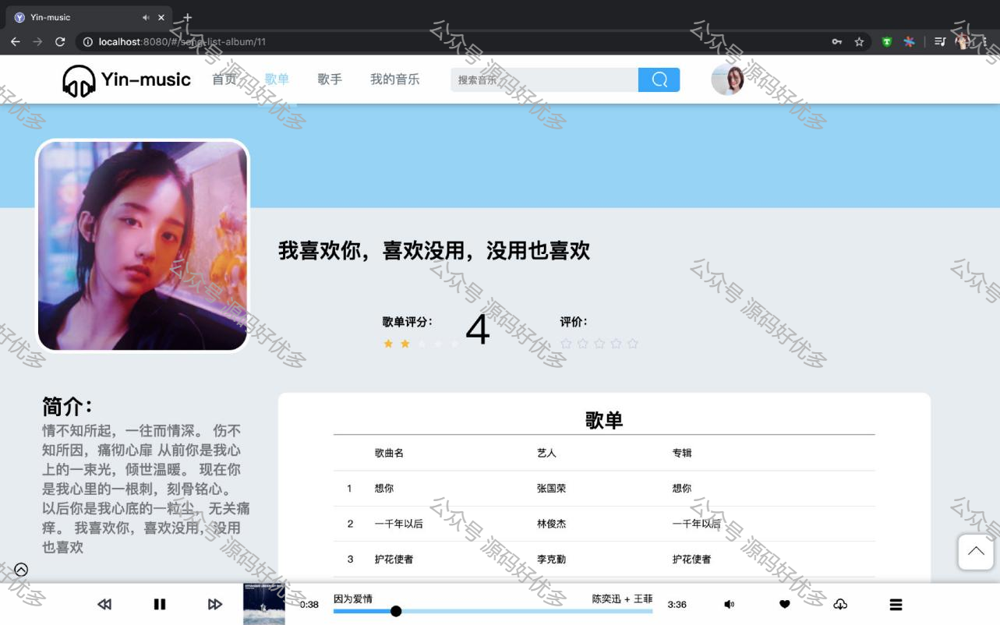
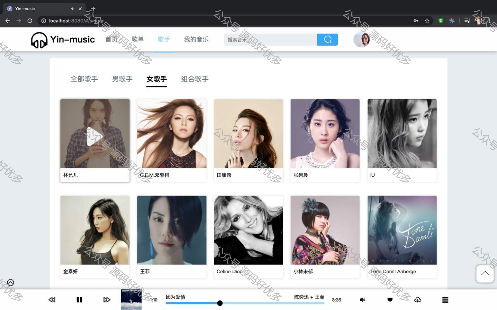
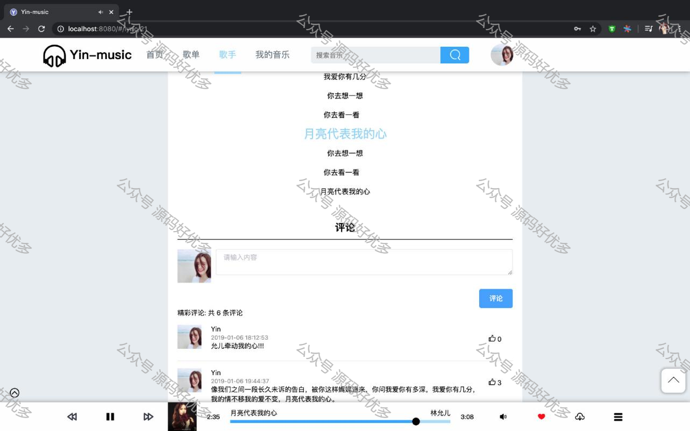
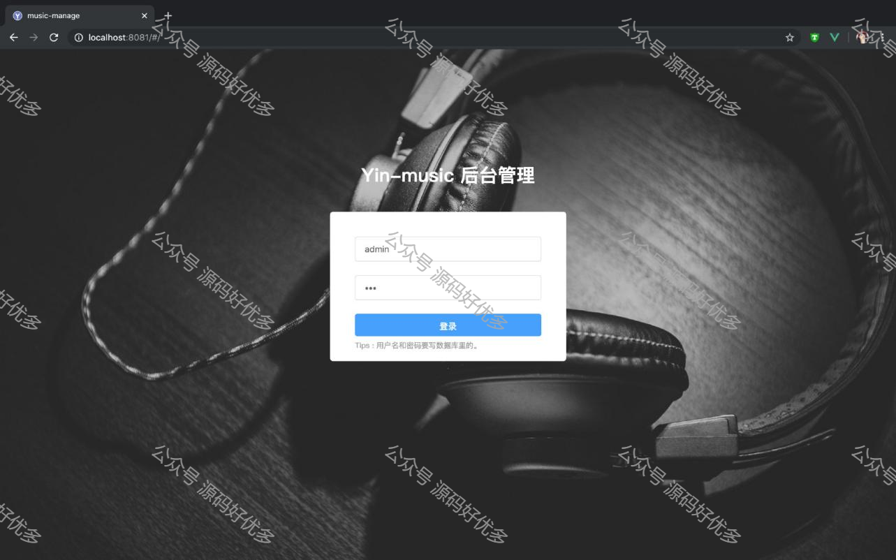
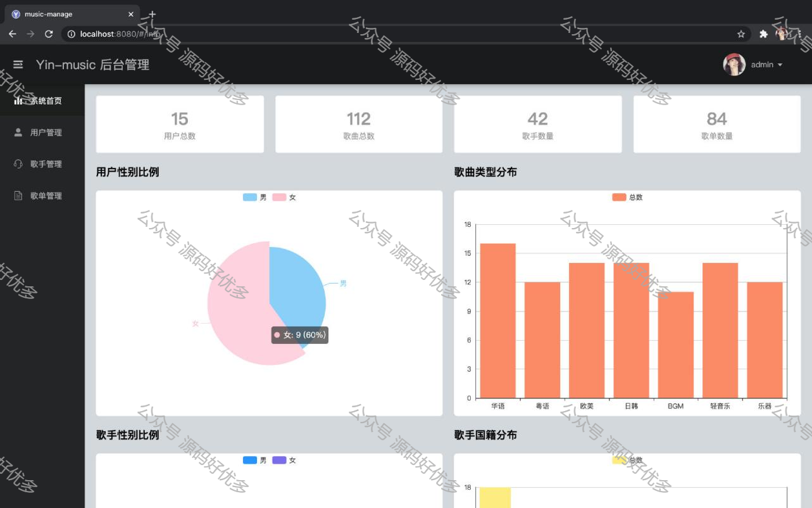
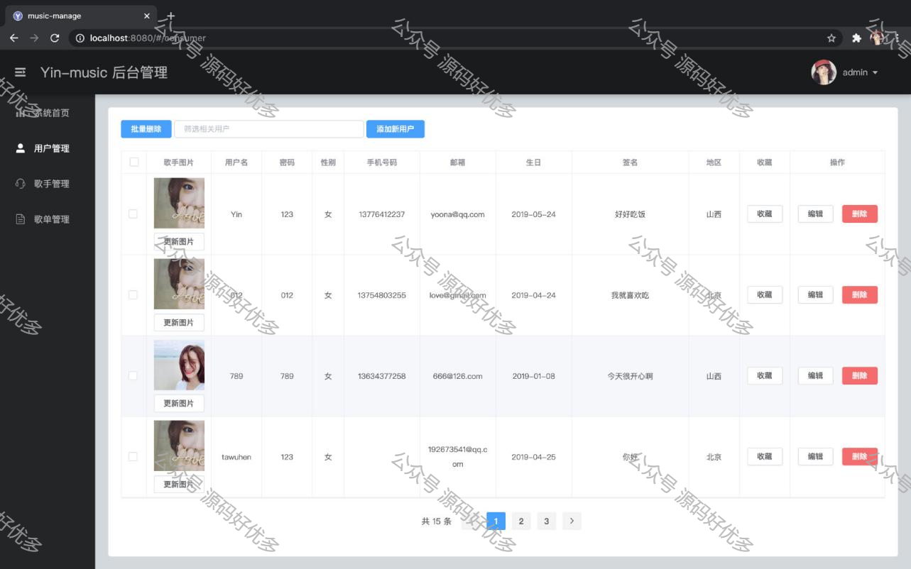
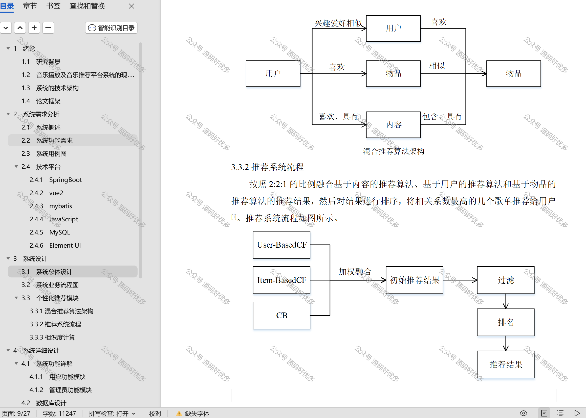

 
## 查看主页获取源码

### 一、作品包含

源码+数据库+设计文档万字+全套环境和工具资源+部署教程

### 二、项目技术

前端技术：Html、Css、Js、Vue、Element-ui

数据库：MySQL

后端技术：Java、Spring Boot、MyBatis

  

### 三、运行环境

开发工具：IDEA

数据库：MySQL5.7

数据库管理工具：Navicat10以上版本

环境配置软件： JDK1.8+Maven3.6.3

前端Nodejs：14

### 四、项目介绍
项目编号：springbootA349

基于Springboot的协同过滤算法推荐音乐播放管理系统总共两个角色，用户和管理员。用户使用前端前台界面，管理员使用前端后台界面。算法推荐为首页歌单推荐，通过收藏歌曲触发

用户：首页推荐歌单、歌单分类分页界面，歌手分类分页界面，我的音乐查看收藏歌曲，搜索音乐，可根据歌手、歌曲、歌单名进行搜索；头像修改、用户信息修改，歌曲播放，进度条拉伸，歌词加载，歌曲收藏，歌曲下载。

管理员：系统首页展示统计数据，用户管理，歌手管理，歌曲管理（修改音源，歌词，后台评论），上传音乐。

### 五、运行截图

  
